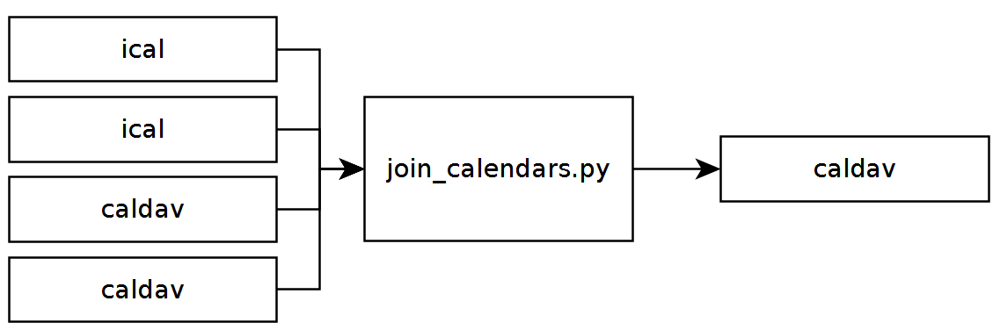

# Join multiple calendars into one
This is a small program to merge appointments of several calendars into one.
The source calendars could be either ical or caldav calenders.
The target calender is a caldav calender.

## Setup
* copy the config.dummy.json into a config.json file
* insert the source and target calender data
* start the script: python join_calendars.py

## example of use
Running the script on a Raspberry Pi every night.